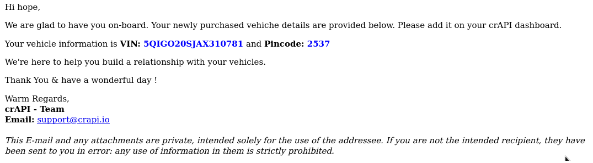
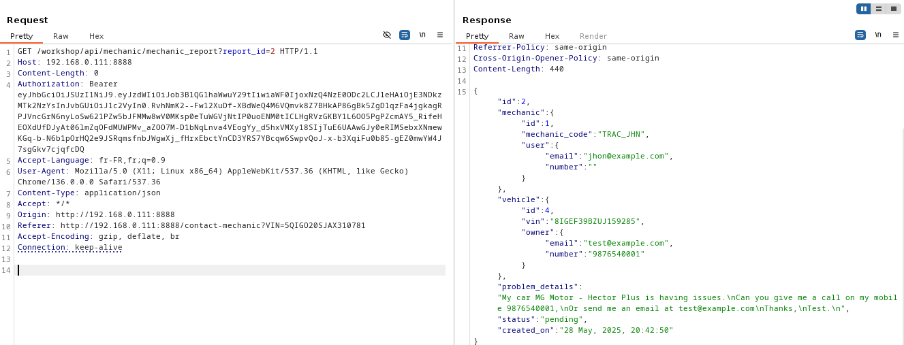
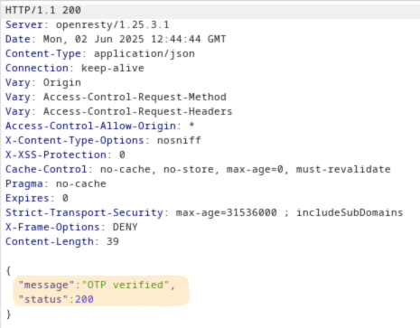
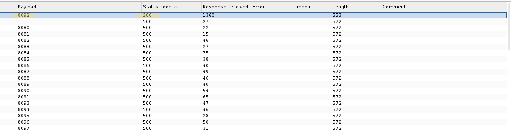
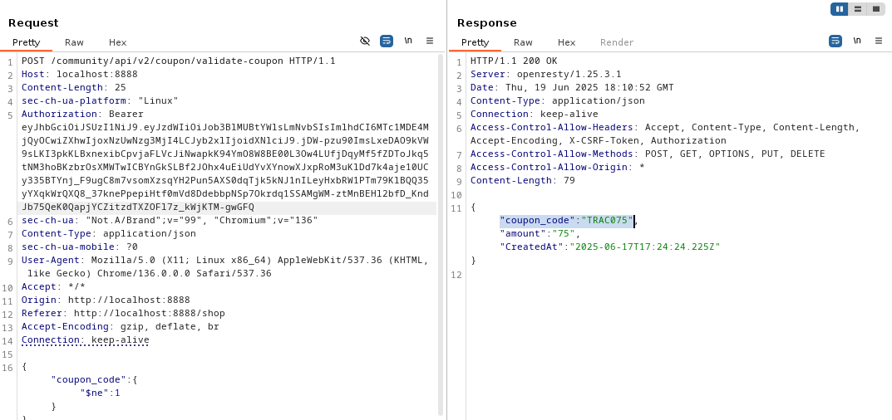

# What is crAPI?
crAPI (Completely Ridiculous API) defines an API which is intentionally vulnerable to the OWASP API Top 10 vulnerabilities. It simulates an API-driven, microservice-based web application that is a platform for vehicle owners. All the challenges in crAPI are based on real-life vulnerabilities that were found in APIs of big companies like Facebook, Uber, and Shopify.

crAPI can be tested using docker, vagrant or other deployement options.

For more informations check this repo by the OWASP team : [crAPI](https://github.com/OWASP/crAPI)

>After completing my preparation for the ACP certification, I started looking for a vulnerable application to test the knowledge I had acquired before taking the exam.
>Fortunately, I came across crAPI, which helped me a lot by allowing me to practice in real-world scenarios.
# The Action
## Recon
Every Penetration testing typically begins with the reconnaissance phase. In the case of API pentest, reviewing the available documentation is often an effective starting point. Many API providers publish detailed specifications using OpenAPI to support developers and consumers. So, API documentation is frequently accessible and can offer valuable insights for testing.

In the case of crAPI, a JSON file containing the OpenAPI documentation for all API endpoints can be found in the crAPI repository. This file can be imported into the Swagger Editor to generate a fancy documentation of the api.

Here is a list of all available endpoints.


This is all the methods associated with the auth endpoint


The documentation also includes detailed information on request and response formats.


We’ll refer to this documentation at different stages during the API's exploitation

# Challenges

There are two approaches to hack crAPI - the first is to look at it as a complete black box test, where you get no directions, but just try to understand the app from scratch and hack it. The second approach is using this page, which will give you an idea about which vulnerabilities exist in crAPI and will direct you on how to exploit them.

Due to time constraints, I decided to tackle the API using the second approach. The exploitation is therefore broken down into challenges, each highlighting the presence of a vulnerability from the OWASP Top 10.

## BOLA Vulnerabilities
BOLA or Broken object level authorization is a vuln that occurs when an API does not properly verify whether the user is authorized to access a specific object or resource
### **Challenge 1** - Access details of another user’s vehicle

We need to leak sensitive information of another user’s vehicle.


After creating an account, I log in to the app to get the following page


I try to add vehicle, but first I need to get the vehicle details sent to my email address in the mailHog web portal running in the port 8025



After adding the vehicle, I notice a refresh button by inspecting it using burpsuite, I found a call to an api that receives a vehicle GUID and returns information about it. 


My next step is to figure out how to access other users’ GUIDs. In the community section, people publish posts, and when the app fetches these posts, it calls an API that, as revealed by Burp Suite, returns extra information, including the vehicle ID


We manage to get sensitve informations about other users' car


### **Challenge 2** - Access mechanic reports of other users

crAPI allows vehicle owners to contact their mechanics by submitting a “contact mechanic” form. The goal is to access others' reports.

When attempting to submit a report, a POST request is made to the /workshop/api/merchant/contact_mechanic endpoint, with all the report details included in the request body. The interesting part lies in the response, which contains a link to the submitted report along with its ID. I then sent a request to this endpoint using id=2 which give me access to report of other user.




## Broken User Authentication

It refers to vulnerabilities that allow attackers to compromise authentication mechanisms, enabling them to impersonate users or gain unauthorized access. This can happen due to issues like:
- Weak or missing authentication checks
- Poor session management
- Insecure token handling

### **Challenge 3** - Reset the password of a different user

In this challenge we need to find an endpoint that make users change their password.

On the login page, there is a feature that allows users to reset their password using their email address. However, the issue is that the application does not require re-authentication when users attempt to change their current password. I used a previously discovered email address to initiate a password reset. When doing so, the application prompts for a one-time password (OTP) sent to the owner's email.


After that the app make a call to /identity/api/auth/v3/check-otp with the OTP, email and new password in the body of the request.


I initially attempted to brute-force the OTP, but the application seemed to restrict the number of attempts. So, I decided to check the documentation and discovered that there is a version 2 of the endpoint that verifies the OTP. I then tried the brute-force attack again using this new endpoint, and it worked.





## Excessive Data Exposure

Excessive data exposure occurs when APIs expose all object properties to API calls rather than what the user needs to act on without considering the object’s sensitivity level.

### **Challenge 4** - Find an API endpoint that leaks sensitive information of other users

The goal is to find an API endpoint that reveals more informations than it should. I remember that I previously used the API endpoint that fetches post data to retrieve the carID. This makes it the likely vulnerable API, as it exposes more information than what the user actually needs.


### **Challenge 5** - Find an API endpoint that leaks an internal property of a video

Every user can add a video to their profile. When a user uploads a video, an API call is made to /identity/api/v2/user/videos. The response includes the video’s ID, name, and data. However, the most interesting part is the conversion_params field, which contains the value "-v codec h264". This is sensitive information that should not be exposed to the user, as it reveals internal configuration details about how the server processes uploaded video content.


## Unrestricted Resource Consumption

This vulnerability occurs when an API allows excessive use of its resources such as CPU, memory, bandwidth, or database connections without imposing limits like rate limiting, Maximum allocable memory, Maximum upload file size, Execution timeouts ...

### **Challenge 6** - Perform a layer 7 DoS using ‘contact mechanic’ feature

When submitting a report to a mechanic using the 'Contact Mechanic' feature, a POST request is sent to /workshop/api/merchant/contact_mechanic with the following value in the request body.


It appears that the api endpoint don't impose limits in the number of time we can call this api. So I changed the value of "repeat_request_if_failed" to true and the value of "number_of_repeats" to 1000, which successfully resulted in an application-level DoS attack.


## BFLA

Broken funcion level authorization is a type of access control vulnerability that occurs when an application fails to properly enforce authorization checks at the level of specific functions or endpoints. This allows authenticated users to access functionality that they should not be allowed to use

### **challenge 7** - Delete a video of another user

When changing the name of the video the app made made a call to /identity/api/v2/user/videos/6 with PUT method, with 6 is the id of my own video. after further investigation i found that the the endpoint accept the method DELETE but i can't use it since I'm not the admin


Changing user to admin in the path of the end point succesefuly delete the video of other user 


## Mass Assignment

This vulnerability arises when a user can alter object properties that are meant to be restricted.

### **challenge 8** - Get an item for free
In the crAPI application, users are given an initial balance of $100, which can be used to purchase items such as wheels or seats. After purchasing an item, it is possible to return it and receive a refund.
To test this functionality, I started by purchasing a wheel for $10 and then initiated a return. The item then appeared with the status "return pending".


We can see our order details using the order details button, the latter made a call to /workshop/api/shop/orders/6 using the get method, and it returns a lot of information about the product and the payment method.


There is a status property that indicates whether the product has been returned or is still pending. Since we're looking for a mass assignment vulnerability, we might be able to exploit this by modifying the value of this property. If successful, this could trick the system into issuing a refund even though the product hasn’t been returned, effectively allowing us to obtain the item for free.

To proceed, I need to identify the endpoint that allows modification of this property.
I begin by sending an OPTIONS request to /workshop/api/shop/orders/6 to discover which HTTP methods are supported by this endpoint.


We can use the PUT method to modify the value of the status property. However, the challenge is that I don’t know the exact value that should be assigned to trigger a refund. To test this, I tried setting the property to "return returned", and in response, the server returned a list of all valid values that the status property can take.


Finally, I was able to successfully change the product's status and obtain an item without paying for it.


### **Challenge 9** - Increase your balance by $1,000 or more

I will use the same endpoint as in the previous challenge, but this time along with the status property I will modify the product’s quantity also.
By doing so, I tricked the system into believing that I had purchased 100 wheels at $10 each, and then returned them all. As a result, the system issued a $1,000 refund.


### **Challenge 10** - Update internal video properties

In Challenge 5, I discovered that the application exposes an internal property of the video object, conversion_params through the endpoint /identity/api/v2/user/videos/6. By leveraging this, I was able to modify the video compression standard from h264 to h265.


## SSRF

Server-side request forgery is a vulnerability that allows an attacker to cause an API to make requests to an unintended location.  It enables an attacker to coerce the application to send a crafted request to an unexpected destination, even when protected by a firewall or a VPN.

### **Challenge 11** - Make crAPI send an HTTP call to "www.google.com" and return the HTTP response.

When submitting a report to a mechanic, the application sends a POST request to the endpoint /workshop/api/merchant/contact_mechanic, including parameters such as the problem description. What’s more interesting, however, is the mechanic_api parameter, which contains a URL pointing to another API. This secondary API receives the report details, stores them, and responds with additional information like an ID and a link to the newly created resource.


So if we put any URL we want, the API will fetch the resource and return the result for us. I tried using "www.google.com" and managed to get a response.


## NoSQL Injection

### **Challenge 12** - Find a way to get free coupons without knowing the coupon code.

In the application, users can use a coupon to claim money 


Usning the fact that the application is vulnerable to nosql injection, I try different payloads and i successefuly retrieve the coupon code 



## SQL Injection 

### **Challenge 13** - Find a way to redeem a coupon that you have already claimed by modifying the database

When I try to reclaim the coupon, I got a message telling me that that the coupon is already claimed 


The application uses two API endpoints in the process of claiming a coupon code. The first endpoint (/community/api/v2/coupon/validate-coupon) checks whether the code is valid by querying a NoSQL database. The second endpoint (/workshop/api/shop/apply_coupon) verifies that the coupon has not already been claimed, using an SQL database.

The challenge asks us to redeem the coupon we already redeem, which requires exploiting SQL injection to bypass the check and successfully reclaim the code.

The application send a POST request to /workshop/api/shop/apply_coupon with two parameters: coupon_code and amount. I tried some payloads and it seems that the application uses postgresql.


At this point I copy the request in a file and I use sqlmap for further inspection. First I use the following command: ```sqlmap -r crapi.rq --dbs``` to detect all databases


