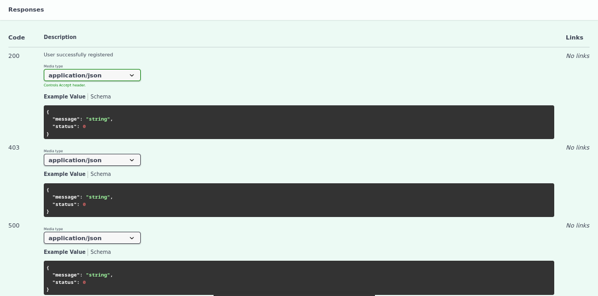

# What is crAPI?
crAPI (Completely Ridiculous API) defines an API which is intentionally vulnerable to the OWASP API Top 10 vulnerabilities. It simulates an API-driven, microservice-based web application that is a platform for vehicle owners. 

crAPI can be tested using docker, vagrant or other deployement options.

For more informations check this repo by the OWASP team : [crAPI](https://github.com/OWASP/crAPI)

>After completing my preparation for the ACP certification, I started looking for a vulnerable application to test the knowledge I had acquired before taking the exam.
>Fortunately, I came across crAPI, which helped me a lot by allowing me to practice in real-world scenarios.
# 
## Recon
Every Penetration testing typically begins with the reconnaissance phase. In the case of API pentest, reviewing the available documentation is often an effective starting point. Many API providers publish detailed specifications using OpenAPI to support developers and consumers. So, API documentation is frequently accessible and can offer valuable insights for testing.

In the case of crAPI, a JSON file containing the OpenAPI documentation for all API endpoints can be found in the crAPI repository. This file can be imported into the Swagger Editor to generate a fancy documentation of the api.

Here is a list of all available endpoints.

This is all the methods associated with the auth endpoint

Wd can also have the params and response format

